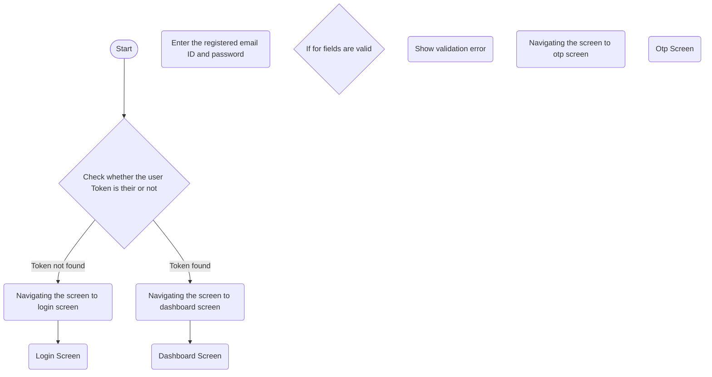

#

## Flow

```mermaid
flowchart TD

    %% Entities
    Start([Start])
    UserTokenCheckAtTheStart{Check whether the user Token is their or not}
    LoginScreen(Login Screen)
    DashboardScreen(Dashboard Screen)
    LogicUserActivity(Enter the registered email ID and password)
    CheckValidation{If for fields are valid}
    ValidationError(Show validation error)
    NavigateToOtp(Navigating the screen to otp screen)
    NavigateToLogin(Navigating the screen to login screen)
    NavigateToDashboard(Navigating the screen to dashboard screen)
    OtpScreen(Otp Screen)


    %% On start of the application
    Start --> UserTokenCheckAtTheStart
    UserTokenCheckAtTheStart -->|Token not found|NavigateToLogin
    UserTokenCheckAtTheStart -->|Token found|NavigateToDashboard

    %% Navigations
    NavigateToLogin --> LoginScreen
    NavigateToDashboard --> DashboardScreen

    %% Login Screen
    LoginScreen
```