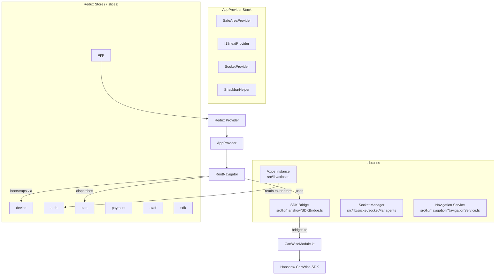
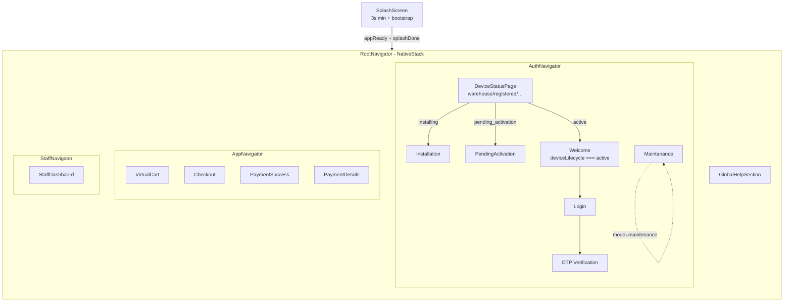
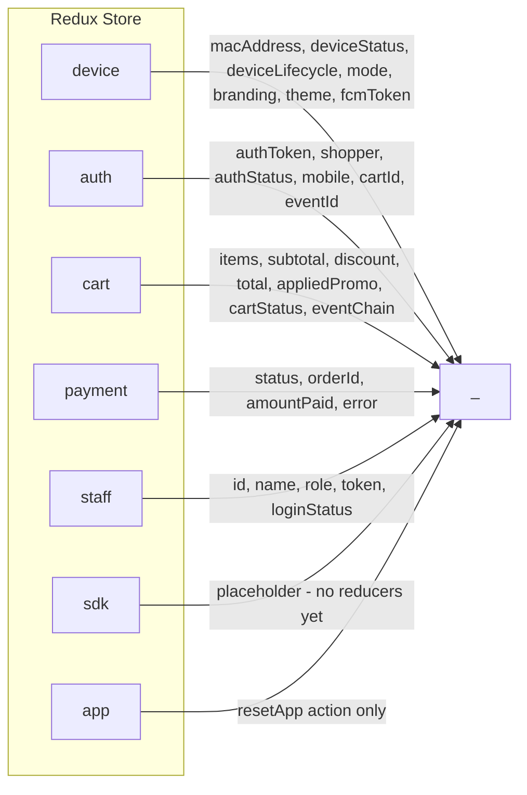
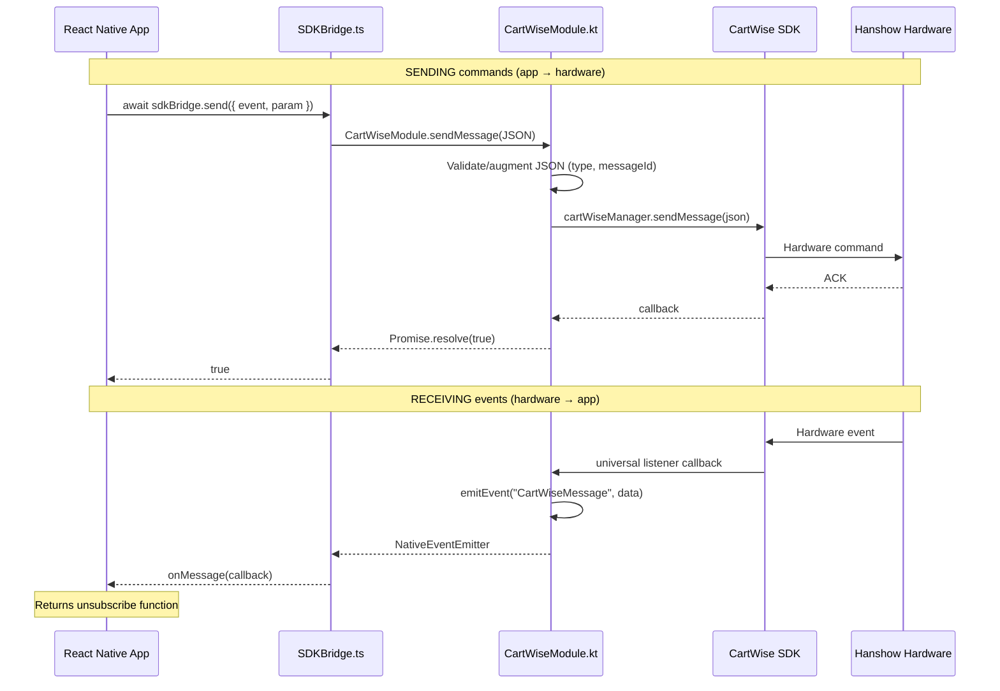
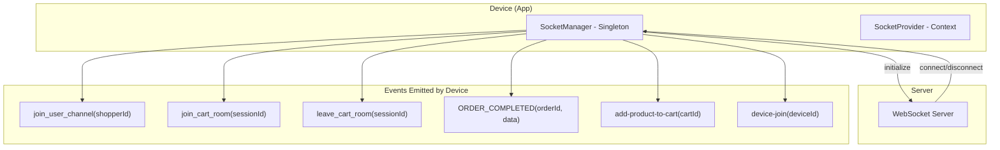

# Architecture Guide — SkipQ Hanshow Device

React Native 0.84.1 (React 19.2.3) retail self-checkout app integrated with Hanshow CartWise hardware SDK via a custom Kotlin native module. Version `v6_20260416`.

---

## 1. Directory Structure

```
SkipQHanshowDevice/
├── App.tsx                          # Root: Redux Provider → AppProvider → RootNavigator
├── index.js                         # RN entry: AppRegistry.registerComponent
├── package.json                     # Dependencies & scripts (RN 0.84.1, Redux TK, i18next, socket.io…)
├── tsconfig.json                    # extends @react-native/typescript-config
├── babel.config.js                  # worklets → dotenv → reanimated (reanimated MUST be last)
├── .eslintrc.js                     # extends @react-native
├── .prettierrc.js                   # single quotes, avoid parens, trailing commas
├── metro.config.js                  # Metro bundler (default)
├── jest.config.js                   # jest preset react-native
├── .env                             # API URLs, AWS keys, Stripe keys (gitignored)
├── AGENTS.md                        # AI agent onboarding guide
├── SEND_vs_RECEIVE_GUIDE.md         # SDK send vs receive deep-dive
│
├── src/
│   ├── components/                  # Shared UI components
│   │   ├── Header/
│   │   ├── LoadingModal/
│   │   ├── Snackbar/                # Snackbar context, helper, item, styles
│   │   ├── StatusBar/               # Redux-connected status bar
│   │   ├── ThemeButton/             # Themed button
│   │   └── LanguageSwitcher/
│   │
│   ├── config/
│   │   ├── currency.ts              # Billing currency options
│   │   └── env.ts                   # Typed env exports from @env
│   │
│   ├── features/                    # Feature-based modules (see §6)
│   │   ├── auth/                    # Login, OTP, splash, installation, activation
│   │   ├── cart/                    # Virtual cart, items, promo, event chain
│   │   ├── checkout/                # Payment flow, order summary
│   │   ├── device/                  # Bootstrap, health monitoring, SDK alerts
│   │   ├── misc/                    # Global help, app state
│   │   ├── notification/            # Push notifications
│   │   ├── sdk/                     # SDK Redux slice (placeholder)
│   │   └── staff/                   # Staff dashboard, events list
│   │
│   ├── i18n/                        # Internationalisation
│   │   ├── index.ts                 # useI18n() hook — loads from Redux, falls back to JSON
│   │   └── locales/
│   │       ├── en.json              # 196+ keys
│   │       └── ar.json              # Arabic translations
│   │
│   ├── lib/                         # Core libraries & bridges
│   │   ├── axios.ts                 # Axios instance + auth token interceptor + logging
│   │   ├── apiErrorHandler.ts       # AxiosError → ApiError converter
│   │   ├── hanshow/
│   │   │   ├── SDKBridge.ts         # JS ↔ Kotlin bridge (COMMANDS, EVENTS, TAGS, send, onMessage)
│   │   │   ├── SDKEventTracker.ts   # Track SDK events → backend
│   │   │   └── requestFunctions.ts  # LED, device info, visible items, kiosk helpers
│   │   ├── navigation/
│   │   │   └── NavigationService.ts # Navigation ref: navigateToPayment/Auth/App/Staff
│   │   ├── socket/
│   │   │   ├── socketManager.ts     # Singleton Socket.io manager
│   │   │   └── SocketProvider.tsx   # React context provider
│   │   ├── s3/
│   │   │   └── uploadVideo.ts       # S3 video upload via RNFS + AWS SDK
│   │   ├── video/
│   │   │   └── RNVideoView.tsx      # Native video view wrapper
│   │   └── deviceDetailsModule/
│   │       └── Devicedetailsmodule.ts  # Battery, CPU, memory, network, etc. + hooks
│   │
│   ├── providers/
│   │   └── AppProvider.tsx          # SafeArea + I18next + Socket + Snackbar wrappers
│   │
│   ├── routes/                      # Navigation (see §3)
│   │   ├── routes.ts                # Route constants + typed param lists
│   │   ├── RootNavigator.tsx        # Splash → Auth | App | Staff
│   │   ├── AuthNavigator.tsx        # DeviceStatus, Installation, Welcome, Login, OTP…
│   │   ├── AppNavigator.tsx         # VirtualCart, Checkout, PaymentSuccess, PaymentDetails
│   │   ├── StaffNavigator.tsx       # Staff dashboard
│   │   └── useNavigatorStyle.ts     # Navigator background colour hook
│   │
│   ├── services/
│   │   └── api/
│   │       └── api.ts               # Promo validation, payment intent, card details, sold products
│   │
│   ├── stores/                      # Redux (see §4)
│   │   ├── store.ts                 # configureStore with 7 slices
│   │   └── hooks.ts                 # useAppDispatch, useAppSelector, useColors
│   │
│   ├── theme/                       # Design tokens (see §8)
│   │   ├── index.ts                 # Combined theme object
│   │   ├── colors.ts                # Full colour palette
│   │   ├── typography.ts
│   │   ├── spacing.ts
│   │   ├── shadows.ts
│   │   ├── layout.ts                # Border radius, opacity, z-index, breakpoints
│   │   └── animations.ts
│   │
│   ├── types/                       # Shared TypeScript interfaces
│   │   ├── apiTypes.ts              # Device, auth, cart, promo, payment, order (491 lines)
│   │   └── staffTypes.ts            # Staff, events, HIL, cart groups (160 lines)
│   │
│   └── utils/                       # Utility functions & data
│       ├── constants/               # Env exports with cleanup
│       ├── helpers.ts               # General helpers
│       ├── colorShades.ts
│       ├── countryData.ts
│       ├── language.ts
│       └── data/                    # Mock data (cart, staff, help content, virtual cart)
│
├── android/                         # Android native project
│   ├── app/
│   │   ├── build.gradle             # SDK 36, minSdk 26, targetSdk 36; CartWiseSDK + fastjson
│   │   ├── local_repo/              # AsyncStorage local Maven repo
│   │   ├── libs/
│   │   │   ├── CartWiseSDK_1.1.0.aar
│   │   │   └── fastjson-1.2.2.jar
│   │   └── src/main/java/com/skipqhanshowdevice/
│   │       ├── MainActivity.kt      # fabricEnabled, New Architecture
│   │       ├── MainApplication.kt   # Package registration, CartWise pre-init
│   │       ├── CartWiseDeviceAdminReceiver.kt  # Kiosk mode admin receiver
│   │       ├── cartwise/
│   │       │   ├── CartWiseModule.kt    # Native bridge — start/stop/sendMessage + universal listener
│   │       │   └── CartWisePackage.kt
│   │       ├── device/
│   │       │   ├── DeviceInfoModule.kt  # MAC address (Android ID fallback on API 29+)
│   │       │   └── DeviceInfoPackage.kt
│   │       ├── devicedetails/
│   │       │   ├── DeviceDetailsModule.java  # Battery, CPU, memory, storage, temp, network…
│   │       │   └── DeviceDetailsPackage.java
│   │       └── video/
│   │           ├── RNVideoViewManager.java
│   │           ├── RNVideoPackage.java
│   │           ├── RotatedVideoTextureView.java
│   │           └── VideoPlayerController.java
│   ├── build.gradle                 # Kotlin 2.1.20, Firebase plugin
│   ├── settings.gradle              # includes :app
│   └── gradle.properties            # newArchEnabled, hermesEnabled
│
├── ios/
│   ├── Podfile
│   ├── SkipQHanshowDevice/
│   │   ├── AppDelegate.swift
│   │   ├── Info.plist               # Portrait, ATS disabled for local networking
│   │   ├── LaunchScreen.storyboard
│   │   └── PrivacyInfo.xcprivacy
│   └── SkipQHanshowDevice.xcodeproj/
│
├── Doc/
│   ├── SDK_LISTENERS_EMITTERS_MAP.md      # Full emitter/listener reference (31 events)
│   ├── QUICK_REFERENCE_LISTENERS_EMITTERS.md
│   └── Listner_Emitter.md
│
└── __tests__/                       # Jest tests
```

---

## 2. Architecture Overview



**Tech stack:** React Native 0.84.1 · Redux Toolkit · React Navigation v7 · i18next · Socket.io · Axios · Stripe SDK · Firebase Messaging · AWS S3

---

## 3. Navigation Architecture



**Type-safe routes** are defined in `src/routes/routes.ts` with typed param lists (`AuthStackParamList`, `AppStackParamList`, `StaffStackParamList`, `RootStackParamList`).

**Route constants** (`ROUTES`) are used everywhere instead of magic strings.

The `RootNavigator` also sets up:
- StripeProvider wrapping the entire navigation
- Global SDK event listener → dispatches `setSdkLastEvent` for cart events
- `useDeviceBootstrap`, `useDeviceHealth`, `useSDKAlerts`, `useNotificationHandler` hooks

---

## 4. Redux State Management

**Store:** `src/stores/store.ts` — 7 slices combined:

```typescript
{
  device:  deviceReducer,   // features/device/stores/deviceSlice.ts
  app:     appReducer,      // features/misc/stores/appSlice.ts
  auth:    authReducer,     // features/auth/stores/authSlice.ts
  cart:    cartReducer,     // features/cart/stores/cartSlice.ts
  staff:   staffReducer,    // features/staff/store/staffSlice.ts
  payment: paymentReducer,  // features/checkout/stores/paymentSlice.ts
  sdk:     sdkReducer,      // features/sdk/stores/sdkSlice.ts
}
```



**Typed hooks** (`src/stores/hooks.ts`):
- `useAppDispatch()` — typed dispatch
- `useAppSelector()` — typed selector with `RootState`
- `useColors()` — returns theme colors from `device.state`

**Axios token interceptor** reads from `store.getState().auth.authToken` via `setTokenAccessor()`.

---

## 5. CartWise SDK Bridge

### Communication flow



### Key distinction

| Method | Direction | Pattern |
|--------|-----------|---------|
| `sdkBridge.send()` | App → Hardware | Async command, `await` it |
| `sdkBridge.onMessage()` | Hardware → App | Listener, returns `unsubscribe` |

### Constants

| Export | Count | Description |
|--------|-------|-------------|
| `COMMANDS` | 13 | `BEGIN_TRACKING`, `END_TRACKING`, `CONTROL_SCANNER`, `CONFIGURE_SCANNER`, `CONTROL_LED`, `CONTROL_LOCK`, `CONTROL_KIOSK`, `BEGIN_MARKETING`, `END_MARKETING`, `QUERY_DEVICE_INFO`, `DEVICE_STATE`, `GET_VISIBLE_PRODUCTS`, `CONTROL_ESL` |
| `EVENTS` | 7 | `PRODUCT_ADDED`, `PRODUCT_REMOVED`, `BARCODE_DETECTED`, `OCCLUSION_DETECTED`, `PROOF_READY`, `VISIBLE_ITEM_COUNT`, `ALERT`, `MARKET_DETECTED` |
| `TAGS` | 12 | Classification tags for event annotation |

### Native module (`CartWiseModule.kt`)

```
Package: com.skipqnative.cartwise
Module:  CartWiseModule
Methods: startService(Promise), stopService(Promise), sendMessage(String, Promise)
```

The universal listener is set up once `startService` succeeds. All SDK events flow through `setupUniversalListener()` → `cartWiseManager.handleMessage {}` → `emitEvent("CartWiseMessage", data)`.

### Command handler (`src/features/device/commandHandler/`)

Maps cart-level events to device commands:
- Sequences for `init`, `logIn`, `logOut`
- `blinkLED(color)` — blink green (positive) or red (negative)
- `setLED(state)` — steady LED by cart status: green=clean, yellow=age_check, red=anomaly

### Request functions (`src/lib/hanshow/requestFunctions.ts`)

Higher-level helpers that wrap `send/onMessage`:
- `turnOnLED(color)` / `turnOffLED()` — LED control
- `queryDeviceInfo()` — returns a Promise, listens for response, 5s timeout
- `getVisibleItemCount()` — returns a Promise with item count
- `toggleKioskMode(action)` — kiosk mode on/off

---

## 6. Feature Structure

Each feature in `src/features/` follows a consistent pattern:

```
auth/                           # feature name
├── api/
│   └── authService.ts          # API calls (login, verify OTP, logout)
├── stores/
│   └── authSlice.ts            # Redux slice for this feature
├── hooks/
│   ├── useLogin.ts             # Business logic hooks
│   ├── useOtp.ts
│   └── useLogout.ts
├── routes/                     # Screens organised by screen
│   ├── SplashScreen/
│   │   └── SplashScreen.tsx
│   ├── LoginScreen/
│   │   └── LoginScreen.tsx
│   ├── OtpScreen/
│   │   └── OtpScreen.tsx
│   └── ...
└── components/                 # Feature-specific UI components
    ├── CountryModal/
    ├── PhoneInput/
    ├── AuthLayout/
    └── Keypad/
```

### Features inventory

| Feature | Slices | API | Hooks | Screens | Description |
|---------|--------|-----|-------|---------|-------------|
| `auth` | `authSlice` | `authService.ts` | `useLogin`, `useOtp`, `useLogout` | Splash, Welcome, Login, OTP, Installation, PendingActivation, Maintanance | Auth flow with phone/OTP |
| `cart` | `cartSlice` | `cartService.ts` | `useCart`, `useCartFetch`, `useCartSDK`, `useCartSocket`, `usePromo`, `useChain` | VirtualCartScreen | Shopping cart, item tracking, promo, event chains |
| `checkout` | `paymentSlice` | `payment.ts` | `usePaymentFunctions` | CheckOutScreen, PaymentSuccess, PaymentDetails | Payment processing with Stripe |
| `device` | `deviceSlice` | `deviceService.ts` | `useDeviceBootstrap`, `useDeviceHealth`, `useSDKAlerts` | DeviceStatusPage | Device lifecycle, health, command handler |
| `misc` | `appSlice` | — | — | GlobalHelpScreen | App-level state, global help |
| `notification` | — | — | `useNotificationHandler` | — | Firebase push notifications |
| `sdk` | `sdkSlice` | — | — | — | Placeholder slice |
| `staff` | `staffSlice` | `staffService.ts` | `useStaff` | StaffDashBoard | Staff events, HIL, cart groups |

---

## 7. Socket Communication



**SocketManager** (`src/lib/socket/socketManager.ts`) is a singleton with:
- WebSocket transport only, auto-reconnect enabled
- `initialize()` — creates connection on first call
- Channel/room joining/leaving methods
- Order and product event emissions

**SocketProvider** wraps the app tree and provides `socket` + `isConnected` via React context.

---

## 8. Theme System

Design tokens live in `src/theme/` and are combined into a single exported object:

| File | Content |
|------|---------|
| `colors.ts` | Full palette: `primary (#BBF743)`, button states, cart status, text, borders, grayscale |
| `typography.ts` | Font definitions |
| `spacing.ts` | Spacing scale |
| `shadows.ts` | Shadow definitions for elevation |
| `layout.ts` | Border radius, opacity, z-index, breakpoints |
| `animations.ts` | Animation configurations |
| `index.ts` | Combined `theme` object (default export) |

**Dynamic branding:** The theme can be overridden at runtime via `deviceSlice.setTheme()` using branding data from the API. This allows per-merchant colour customisation.

---

## 9. Native Modules (Android)

| Module | Package | File | Key Methods |
|--------|---------|------|-------------|
| **CartWise** | `com.skipqnative.cartwise` | `CartWiseModule.kt` | `startService`, `stopService`, `sendMessage` |
| **DeviceInfo** | `com.skipqnative.device` | `DeviceInfoModule.kt` | MAC address (Android ID fallback on API 29+) |
| **DeviceDetails** | `com.skipqnative.devicedetails` | `DeviceDetailsModule.java` | Battery, CPU, memory, storage, temperature, network, peripherals, device info |
| **RNVideoView** | `com.skipqnative.video` | `RNVideoViewManager.java` | Native video component with rotation support |

**JAR dependencies** in `android/app/libs/`:
- `CartWiseSDK_1.1.0.aar` — Hanshow CartWise hardware SDK
- `fastjson-1.2.2.jar` — JSON parsing

---

## 10. Configuration & Environment

### Babel plugin order (critical)

```javascript
plugins: [
  'react-native-worklets/plugin',   // 1st
  'module:react-native-dotenv',     // 2nd (moduleName: '@env')
  'react-native-reanimated/plugin', // 3rd — MUST be last
]
```

### Environment variables (`.env`)

| Variable | Purpose |
|----------|---------|
| `BASE_URL` | API base URL (dev: `http://192.168.1.27:8000`) |
| `STRIPE_TEST_KEY` / `STRIPE_PRODUCTION_KEY` | Stripe publishable keys |
| `QR_SECRET` | QR code signing secret |
| `WEB_BASE_URL` | Web app URL (`https://skipq.prologic-technologies.com`) |
| `AWSURL`, `AWS_ACCESS_KEY`, `AWS_SECRET_KEY` | AWS S3 config |
| `AWS_BUCKET`, `AWS_REGION`, `AWS_FOLDER` | S3 bucket settings |

Import via `import { BASE_URL } from '@env'` (typed in `src/config/env.ts`).

### Android build settings

| Setting | Value |
|---------|-------|
| compileSdk | 36 |
| minSdk | 26 |
| targetSdk | 36 |
| New Architecture | `enabled` |
| Hermes | `enabled` |
| Kotlin | 2.1.20 |

---

## 11. Development Scripts

```sh
npm start            # Metro dev server
npm run android      # Run on Android device/emulator
npm run ios          # Run on iOS simulator

npm run lint         # ESLint
npx tsc --noEmit     # TypeScript check
npm test             # Jest tests

npm run gradlew-clean   # Android clean
npm run build-android   # Android debug build
npm run release-apk     # Android release APK
npm run reset-cache     # Reset Metro cache
```

---

## 12. Conventions

### Code style (enforced by Prettier + ESLint)

- **Quotes:** single quotes
- **Arrow parens:** `avoid` — `const fn = x => x` (single arg, no parens)
- **Trailing commas:** `all`
- **ESLint:** extends `@react-native`

### Naming

| Category | Convention | Example |
|----------|-----------|---------|
| Files | PascalCase for components, camelCase for utils | `LoginScreen.tsx`, `cartService.ts` |
| Routes | PascalCase with constant | `ROUTES.LOGIN`, `ROUTES.VIRTUAL_CART` |
| Redux slices | camelCase feature name + `Slice` | `authSlice`, `cartSlice` |
| Hooks | `use` prefix + PascalCase | `useDeviceBootstrap`, `useCartSDK` |
| SDK Commands | `UPPER_SNAKE_CASE` | `COMMANDS.BEGIN_TRACKING` |
| SDK Events | `UPPER_SNAKE_CASE` | `EVENTS.PRODUCT_ADDED` |

### Import patterns

- Env vars: `import { BASE_URL } from '@env'`
- Redux hooks: `import { useAppDispatch, useAppSelector } from '../stores/hooks'`
- Feature files import from sibling `stores/`, `api/`, `hooks/`, `components/` directories
- Cross-feature imports go through the store (never direct slice-to-slice)

### Architecture rules

1. **Never call `sdkBridge.send()` without `await`** — the native bridge is async
2. **Always clean up `onMessage` listeners** on unmount — returns unsubscribe function
3. **Babel plugin order must be maintained** — `react-native-reanimated/plugin` last
4. **Feature code stays in its feature folder** — shared code goes in `src/lib/` or `src/components/`
5. **Route constants over magic strings** — use `ROUTES.LOGIN` not `'Login'`
