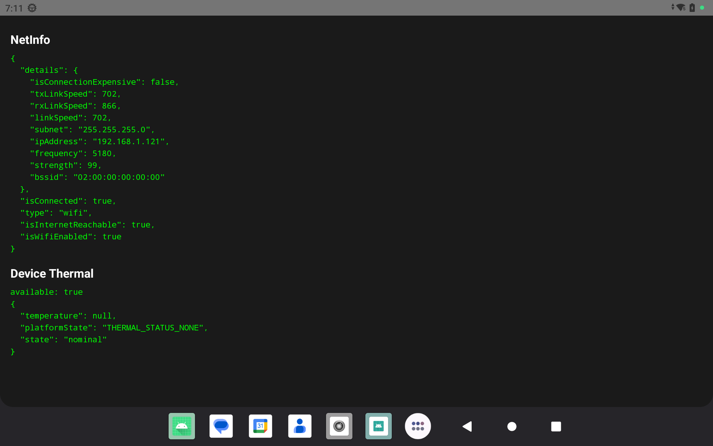

# What to do? 2026 05 11

## 1. health api integration:


**API Interval:** 60 seconds


```cmd
curl --location --request PUT 'http://192.168.1.148:8000/device/health' \
--header 'Content-Type: application/json' \
--data '{
  "deviceId": "396374202667616254",

  "battery": 75,
  "cpu": 56,
  "memory": 89,
  "storage": 49,
  "temperature": 32,
  "wifi": "weak",

  "status": "offline",

  "firmwareVersion": "FW-2.1.4",
  "firmwareStatus": "outdated",

  "ipAddress": "192.168.1.25",
  "signalStrength": 12,

  "peripherals": {
    "camera": true,
    "scale": false,
    "printer": false
  },

  "cpuLoad": 97,
  "cpuTemp": 89,
  "ramUsage": 95,
  "gpuLoad": 92,
  "gpuTemp": 85,

  "version": "1.0.9"
}'
```



``` json
// Currently we are getting 
{
    "battery": 100,
    "memory": 8,
    "ramUsage": 8,
    "storage": 29,
    "ipAddress": "192.168.1.121",
    "peripherals": {
        "camera": true,
        "scale": false,
        "printer": false
    },
    "version": "1.0",
    "deviceId": "396374202667616254",
    "firmwareVersion": "TKQ1.240727.V1.0.1",
    "status": "online"
}

// What we need to share
{
  "deviceId" : "396374202667616254", // ✔

  "battery" : 75, // ✔
  "cpu": 56, // library not yet found
  "memory" : 89, // ✔
  "storage" : 49, // ✔
  "temperature": 32, // getting null value in react-native-device-thermal
  "wifi": "weak", // ✔ can be determined by strength in @react-native-community/netinfo

  "status" : "offline", // ✔ we are getting @react-native-community/netinfo

  "firmwareVersion" : "FW-2.1.4", // ✔
  "firmwareStatus": "outdated", // should be computable from backend.

  "ipAddress" : "192.168.1.25", // ✔
  "signalStrength": 12, // ✔ in @react-native-community/netinfo the signal strength is not in dBm

  "peripherals": {
    "camera" : true, // ✔
    "scale": false,
    "printer": false
  },

  "cpuLoad": 97, // library not yet found
  "cpuTemp": 89, // library not yet found
  "ramUsage" : 95, // ✔
  "gpuLoad": 92, // library not yet found
  "gpuTemp": 85, // library not yet found

  "version" : "1.0.9" // ✔
}
```