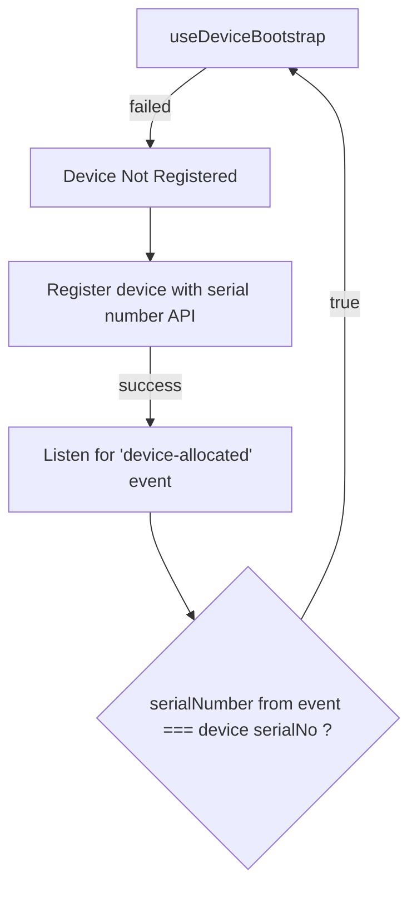

# TO-DO 15 May 2026

## Register Device API


## 1. Register Device Api.

```cmd
curl --location 'http://192.168.1.27:8000/device/register-device' \
--header 'Content-Type: application/json' \
--data '{
  "deviceId": "396374202667616250",
  "status": "online",
  "is_inshopping_mode": null,
  "created_by": null,
  "deviceInfo": null
}'
```




