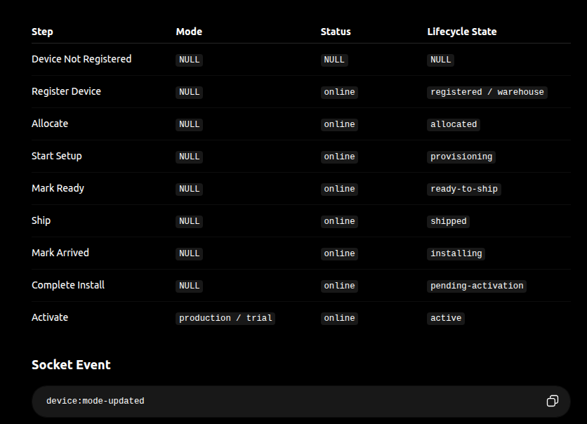
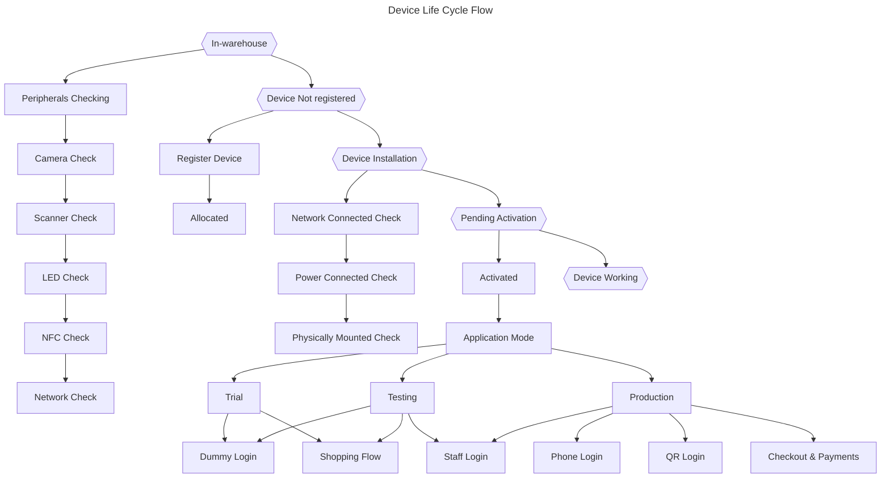

# TO DO

## 1. Device Lift Cycle Implementation:(TBD)

## 2. Device checking with application:

Testing of the device compoenents with application

### a. Scanner Testing(*) - using SDK
### b. Light Testing(*) - using SDK
### c. Display Testing - using Native Code
### d. Camera Testing(*) - using Native Code
### e. Touch Testing - using Native Code
### f. NFC Testing (TBD) - using Native Code

## 3. Device Health Timer & checks for device activation: