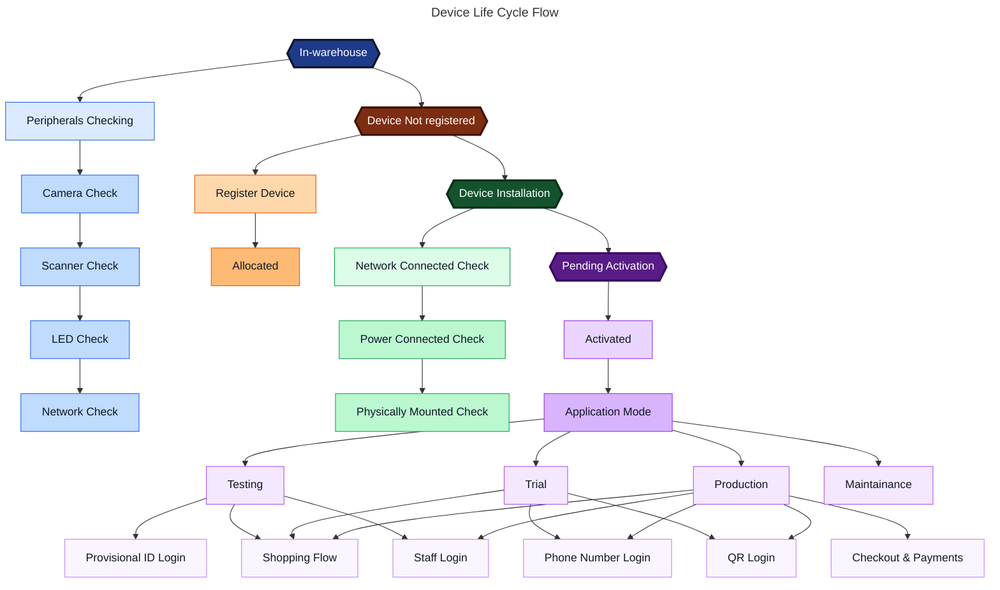

# TO DO

## 1. Device Lift Cycle Implementation:(TBD)

### A. Peripherals Checking

This is when are getting device has arrived in warehouse and before it could be used, it is testing for it's peripheral components to be working fine or not

**Peripheral Components**

	1. Cameras
	2. Scanner
	3. LED
	4. Network

Then it will go for registration flow.

### B. Device Registration Flow

This is where we register the new device to our system. and allocate it to a merchant and store.

Here first we check whether the device is registered with the system or not.
If not registered then we ask user for registering device or not
User will confirm for that by clicking on `Register Device` button
This will call an api which register the device with it's serial number.
And in return we get a device ID that can be seen in Admin panel.

Once admin allocates the device to a store and a merchant then device is ready to be shipped.
Once the shippment is confirmed then we will go for installation flow.

### C. On Ground Installation Flow

This is where we have a final check whether the device is working fine for the on ground environment

**CheckList Contains**

	1. Network Connection
	2. Power Connectino
	3. Phycally Device Mounting

These check points are for on ground team to make ensure that the device is working fine before it's activation.
Once it is confirmed from the staff's end , we are going to move to activation flow

### D. Activation Flow

Here we wait for admin to activate the device for usage

Once the admin activates the device , the we go to welcome screen.

### E. Active Account Modes:

Here we are going to enable the functionalities of the device's main usage according to the mode the device is in.

**Device Active Modes**

	1. **Trial** - Allows Provisional ID Login and Only Disable Checkout and Staff Login functionality 
	2. **Testing** - Allows Provisional ID Login and Staff Login and only disables Checkout functionality
	3. **Production** - All main feature are active and allows phone / otp number login and checkout and billing
	4. **Maintenance** - Here we are going to show a screen telling the user that applicaiton is in maintainance state and wait for admin to change the state of the device to some other state.

## 2. Device Health Timer & checks for device activation:

	a. We will get the time duration for device health api from the get device details.
	b. adjust the states and time interval for hitting the api accordingly.