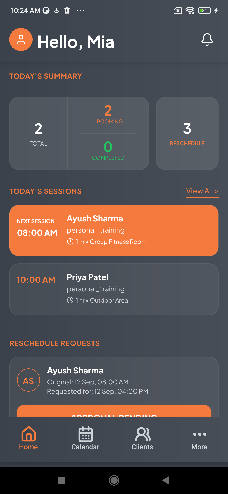
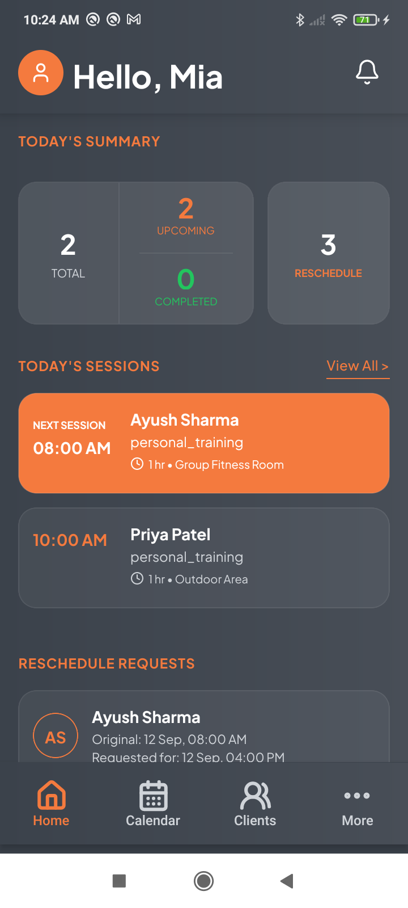

# Milestone 1 — Client Feedback & Requirements

## Overview

This document captures the client feedback and requirements identified during the **Milestone 1 review**. The feedback is organized by functional area, along with the current status and any dependencies or open questions.

>[!IMPORTANT]
>
> | Status               |  Items |
> | -------------------- | -----: |
> | `To Do`              |     10 |
> | `Waiting for Client` |      4 |
> | **Total**            | **14** |

---

---

# 1. UI

## 1.1 Logo Visibility and Typography `To Do`

* Use a **white background** to ensure the logo (mobile app icon) stands out.

| Change    | From                                     | To                                        |
|-----------|------------------------------------------|-------------------------------------------|
|           |    |  |

---

## 1.2 Application Color Theme `To Do`

* Confirm whether both applications should use the **same color theme** or different themes.

|           | Screen 1                                 | Screen 2                                 |
|-----------|------------------------------------------|------------------------------------------|
| **Phone** | Redmi Note 8                             | Redmi 9A                                 |
| **Image** |  |  |

>[!Note] Althought the color code is same for both the application, them might get affected by the different screens, as in screen 1 background color seem a bit lighter than that in screen 2

---

## 1.3 Mobile UI Theme Variants `To Do`

Provide client-specific mobile screen theme variants:

1. Lighter grey background with dark cards

2. Also implement and inverted theme with a dark background and lighter cards.

---

## 1.4 SHRED Mobile App Screen Design References `Waiting for Client`

Use the **[SHRED](https://play.google.com/store/apps/details?id=app.shred.android&pcampaignid=web_share) screen references provided by the client** as the design baseline for the following sections:

* Nutrition
* Training
* Education
* Profile

### Dependency

* Client needs to provide the SHRED screen references.

---

# 2. Diet

## 2.1 Meal Master Data Configuration `Waiting for Client`

* Admin should be able to configure meal information, including:

  * Meal name
  * Base quantity / portion size
  * Calories
  * Other relevant meal information

### Dependency

* Client needs to provide the Meal master data.

---

## 2.2 Diet Plan and Calorie Adjustment `Waiting for Client`

Users should be able to modify the quantity of assigned meal items. The system should automatically:

* Recalculate calorie counts based on the modified quantity.
* Update the remaining daily calorie allowance accordingly.

### 2.2.1 Partial Meal Consumption Tracking

If a user consumes less than the recommended quantity, the system should calculate calories based on the **actual quantity consumed**.

**Example:**

> If 4 chapatis are recommended for breakfast and the user consumes only 2, calories should be calculated for 2 chapatis.

### 2.2.2 Alternate Meal Options

* Nutritionists will provide alternate meal options.
* Approximately **3 overall meal alternatives** should be available.
* Users should not be restricted to a single meal option.

### 2.2.3 Manual Meal Selection

If predefined alternatives are not available, users should be able to:

1. Search from existing meals.
2. Add a meal manually if it does not already exist.
3. Enter the calorie value for the manually added meal.

### Dependency

* Client needs to provide the diet plan catalog and meal alternatives.

---

## 2.3 Weekly Calorie Averages `To Do`

Provide **weekly calorie averages**.

Users should be able to:

* Review weekly calorie intake.
* Manage/review calorie consumption based on daily calorie data.

---

# 6. Membership

## 6.1 Membership Upgrade Discount `To Do`

Apply an appropriate discount when a client upgrades an existing membership.

### Example

A client currently having a **3-month membership** should receive an applicable discount when upgrading to another membership plan.

---

## 6.2 Student Membership Discount `Waiting for Client`

Allow users to qualify for a student discount by:

1. Selecting their university.
2. Entering their student ID.
3. Completing the required student verification process.

### Dependency

Client will provide:

* Login details
* Screen references

### Open Questions

* How should the system verify that the student is genuine?
* How should the system prevent a student from using another student's credentials?

---

# 7. Workout / Trainer

## 7.1 Daily and Ongoing Workout Modifications `To Do`

Trainers should be able to modify a client's workout:

1. **Overall workout**
2. **Specific day's workout**

   * Example: Goal Less Workout - When client don't want to follow hit usual workout plan, but has to do some excersise so is given some light excersises for that day.

### Tracking Changes

Workout changes should be trackable, including:

* When a trainer leaves.
* When another trainer is assigned.
* Changes made by trainers.
* Relevant users should be notified when applicable.

### Workout History

Trainers should be able to view **past workouts assigned to a client**.
i.e maintaining a daily client's activity log.

Past workout details should include:

* Workout Template Name
* Exercise List
* Exercise Name
* Sets
* Reps
* Other relevant exercise metadata

---

# 8. Client Dependencies

The following items are currently dependent on information or assets from the client:

### UI

* [SHRED](https://play.google.com/store/apps/details?id=app.shred.android&pcampaignid=web_share) mobile app screen references

### Diet

* Meal master data
* Diet plan catalog
* Alternate meal options

### Membership

* Student membership login details
* Student membership screen references
* Clarification on student verification

---