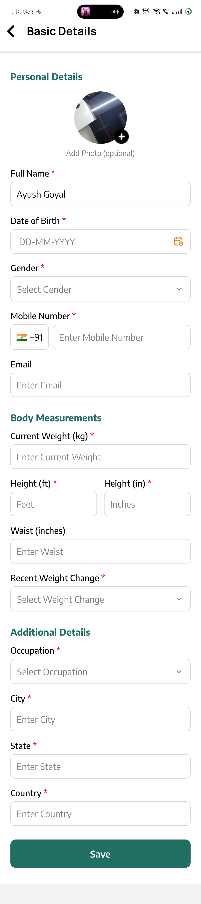
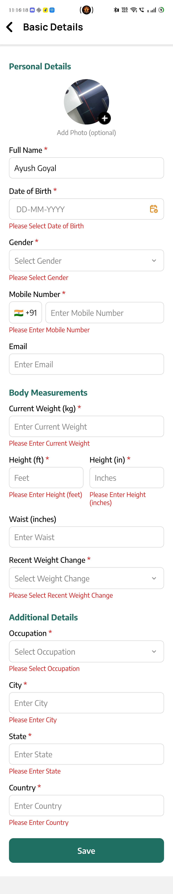

# Dietitian Patient Questionnaire

> **Pre-Consultation Health & Nutrition Assessment — Mobile App**

## Questionnaire Flow

`Basic Details → Medical History → Goals → Food Habits → Allergies / Intolerances → Lifestyle / Activity → Review → Submit`

---

## 1. Basic Details

### Personal Details

| Field         | Input Type              | Options / Values                          | Required | Conditional |
| ------------- | ----------------------- | ----------------------------------------- | -------- | ----------- |
| Full Name     | Text Input              | Free text                                 | Yes      | —           |
| Date of Birth | Date Picker             | Date                                      | Yes      | —           |
| Gender        | Bottom Sheet / Dropdown | Male / Female / Other / Prefer not to say | Yes      | —           |
| Mobile Number | Phone Input             | Phone number                              | Yes      | —           |
| Email         | Email Input             | Email address                             | No       | —           |
| Profile Photo | Image Upload            | Camera / Gallery                          | No       | —           |

### Body Measurements

| Field                | Input Type           | Options / Values                               | Required | Conditional                                  |
| -------------------- | -------------------- | ---------------------------------------------- | -------- | -------------------------------------------- |
| Current Weight       | Number Input         | kg                                             | Yes      | —                                            |
| Height               | Feet & Inches Input  | Feet + Inches                                  | Yes      | —                                            |
| Waist Measurement    | Number Input         | inches                                         | No       | —                                            |
| Recent Weight Change | Radio / Bottom Sheet | No change / Increased / Decreased              | Yes      | —                                            |
| Amount of Change     | Number Input         | kg                                             | Yes*     | Recent Weight Change = Increased / Decreased |
| Time Period          | Dropdown             | <1 month / 1–3 months / 3–6 months / >6 months | Yes*     | Recent Weight Change = Increased / Decreased |

### Additional

| Field                  | Input Type     | Options / Values                                                                  | Required | Conditional        |
| ---------------------- | -------------- | --------------------------------------------------------------------------------- | -------- | ------------------ |
| Occupation             | Dropdown       | Office Work / On-Field Work / Student / Homemaker / Retired / Manual Work / Other | Yes      | —                  |
| Other Occupation       | Text Input     | Specify occupation                                                                | Yes*     | Occupation = Other |
| City / State / Country | Location Input | City / State / Country                                                            | Yes      | —                  |

---

## 2. Medical History

### Existing Conditions

| Field              | Input Type            | Options / Values                                                                                                                                                | Required | Conditional                |
| ------------------ | --------------------- | --------------------------------------------------------------------------------------------------------------------------------------------------------------- | -------- | -------------------------- |
| Medical Conditions | Multi-select Dropdown | Diabetes / Prediabetes / Thyroid / PCOS-PCOD / High Cholesterol / High BP / Heart / Kidney / Liver / GERD-Acidity / Anemia / Arthritis / Obesity / Other / None | Yes      | —                          |
| Other Condition    | Text Input            | Specify condition                                                                                                                                               | Yes*     | Medical Conditions = Other |

### Symptoms

| Field            | Input Type | Options / Values                                                                                                        | Required | Conditional              |
| ---------------- | ---------- | ----------------------------------------------------------------------------------------------------------------------- | -------- | ------------------------ |
| Current Symptoms | Dropdown   | Fatigue / Acidity / Constipation / Diarrhea / Bloating / Headache / Dizziness / Nausea / Appetite Change / Other / None | Yes      | —                        |
| Other Symptom    | Text Input | Specify symptom                                                                                                         | Yes*     | Current Symptoms = Other |
| Symptom Duration | Dropdown   | <1 week / 1–4 weeks / 1–6 months / >6 months                                                                            | Yes*     | Current Symptoms ≠ None  |

| Screen                                        | With Validation                               |
| --------------------------------------------- | --------------------------------------------- |
|  |  |

### Medication & Supplements

* **Taking medication?** — Yes / No — **Required**
* **Medicine name, dosage, frequency, reason** — **Conditional**
* **Taking supplements?** — Yes / No — **Required**
* **Supplements** — Protein / Multivitamin / Vitamin D / B12 / Iron / Calcium / Omega-3 / Other — **Conditional**

### History & Reports

* **Surgery?** — Yes / No; name/date if Yes — **Required**
* **Was Hospitalization?** — Yes / No — **Required**
* **Family history** — Diabetes / Heart / BP / Obesity / Thyroid / Cancer / Kidney / Other / None — **Required**
* **Recent medical/lab reports?** — Yes / No — **Required**
* **Upload Reports up to specific limit** — PDF / JPG / PNG — **Conditional**

---

## 3. Goals

### Primary Goal

* **Goal** — Weight Loss / Weight Gain / Maintain Weight / Muscle Gain / General Health / Energy / Digestion / Diabetes / Cholesterol / BP / PCOS-PCOD / Sports Nutrition / Pregnancy Nutrition / Child Nutrition / Other — **Required**

#### Target

* **Target Weight** — kg — **Conditional**
* **Preferred Timeline** — 1 month / 3 months / 6 months / No specific timeline — **Conditional**

### Motivation

* **Main reason** — Health / Appearance / Fitness / Energy / Medical condition / Doctor recommendation / Event / Other — **Required**
* **Motivation** — 1 to 5 — **Required**

---

## 4. Food Habits

### Diet Preference

* **Diet type** — Vegetarian / Vegan / Eggetarian / Non-Vegetarian / Jain / Other — **Required**

### Meal Pattern

* **Meals per day** — 1 / 2 / 3 / 4 / 5+ — **Required**
* **Breakfast, Lunch, Dinner times** — Time — **Required**
* **Snacks between meals?** — Yes / No; typical snacks if Yes — **Required**

### Food Frequency

The following food categories use:

`Daily / 3–5× week / 1–2× week / Rarely / Never`

| Food Category | Frequency                                      |
| ------------- | ---------------------------------------------- |
| Fruits        | Daily / 3–5× week / 1–2× week / Rarely / Never |
| Vegetables    | Daily / 3–5× week / 1–2× week / Rarely / Never |
| Dairy         | Daily / 3–5× week / 1–2× week / Rarely / Never |
| Eggs          | Daily / 3–5× week / 1–2× week / Rarely / Never |
| Chicken/Meat  | Daily / 3–5× week / 1–2× week / Rarely / Never |
| Fish          | Daily / 3–5× week / 1–2× week / Rarely / Never |
| Fried Food    | Daily / 3–5× week / 1–2× week / Rarely / Never |
| Fast Food     | Daily / 3–5× week / 1–2× week / Rarely / Never |
| Sweets        | Daily / 3–5× week / 1–2× week / Rarely / Never |
| Soft Drinks   | Daily / 3–5× week / 1–2× week / Rarely / Never |

### Eating Behaviour

* **Outside/home delivery** — Daily / 3–5× week / 1–2× week / Rarely
* **Meal skipping** — Never / Occasionally / Frequently / Almost daily
* **Late-night eating** — Never / Sometimes / Often / Daily
* **Water** — <1L / 1–2L / 2–3L / >3L
* **Sugary drinks** — Never / Occasionally / Daily / Multiple/day
* **Desserts** — Rarely / 1–2× week / 3–5× week / Daily

### Typical Daily Food

* **Breakfast** — Free text
* **Mid-morning** — Free text
* **Lunch** — Free text
* **Evening snack** — Free text
* **Dinner** — Free text
* **Late-night food** — Free text

### 24-Hour Recall *(Recommended)*

* **Yesterday's meals/drinks** — Meal-by-meal time + approximate quantity
* **Meal photo** — Optional upload

---

## 5. Allergies / Intolerances

### Food Allergy

* **Any food allergy?** — Yes / No / Not sure — **Required**
* **Allergies** — Milk/Dairy / Eggs / Peanuts / Tree nuts / Wheat / Gluten / Soy / Fish / Shellfish / Other — **Conditional**
* **Other allergy** — Text — **Conditional**

### Food Intolerance

* **Any intolerance/discomfort?** — Yes / No / Not sure — **Required**
* **Trigger food** — Free text — **Conditional**
* **Reaction** — Bloating / Gas / Diarrhea / Stomach pain / Skin reaction / Headache / Other — **Conditional**

### Restrictions

* **Foods avoided for personal/cultural/other reasons?** — Yes / No; specify if Yes
* **Food avoided** — **Conditional**
* **Foods strongly disliked** — Free text — **Optional**

---

## 6. Lifestyle / Activity

### Physical Activity

* **Daily activity** — Mostly sitting / Light / Moderate / Very active / Extremely active — **Required**
* **Exercise regularly?** — Yes / No — **Required**
* **Exercise type** — Walking / Running / Gym / Yoga / Cycling / Swimming / Sports / Other — **Conditional**
* **Days per week** — 1–7 — **Conditional**
* **Duration** — <30 / 30–60 / 60–90 / >90 min — **Conditional**

#### Activity Details

| Field         | Options / Values                                                     |
| ------------- | -------------------------------------------------------------------- |
| Activity Type | Walking / Running / Gym / Yoga / Cycling / Swimming / Sports / Other |
| Specify Name  | Required when Activity Type = Other                                  |
| Days per Week | 1–7                                                                  |
| Duration      | <30 min / 30–60 min / 60–90 min / >90 min                            |

### Daily Steps

* **Steps/day** — <2,000 / 2,000–5,000 / 5,000–8,000 / 8,000–10,000 / 10,000+ / Don't know — **Required**

### Sleep

* **Hours/night** — <5 / 5–6 / 6–7 / 7–8 / 8+ — **Required**
* **Sleep quality** — 1–5 — **Required**
* **Usual sleep time** — Time — **Required**
* **Wake-up time** — Time — **Required**

### Work & Routine

* **Work schedule** — Day / Night shift / Rotating / WFH / Irregular / Other — **Required**
* **Sitting hours/day** — <2 / 2–4 / 4–6 / 6–8 / 8+ — **Required**

### Stress

* **Stress level** — 1–5 — **Required**
* **Does stress affect eating?** — Eat more / Eat less / Sometimes / No — **Required**

---

## 7. Conditional Question Logic

* **Diabetes/medical condition selected** → Show relevant follow-up questions and report upload.
* **Weight Loss/Weight Gain selected** → Ask target weight and timeline.
* **Allergy = Yes** → Ask affected food and reaction.
* **Intolerance = Yes** → Ask trigger food and symptoms.
* **Medication = Yes** → Ask medicine name, dosage, frequency and reason.
* **Supplements = Yes** → Ask supplement type/details.
* **Exercise = Yes** → Ask type, days/week and duration.
* **Reports = Yes** → Enable medical/lab report upload.
* **Other selected** → Show `Please specify` field.

---

## 8. Mobile Screen Flow

1. **Screen 1 — Basic Details**
2. **Screen 2 — Medical History**
3. **Screen 3 — Goals**
4. **Screen 4 — Food Habits**
5. **Screen 5 — Allergies / Intolerances**
6. **Screen 6 — Lifestyle / Activity**
7. **Screen 7 — Review Answers**
8. **Screen 8 — Submit & Confirmation**

---

## 9. Product Rules

* Show progress, e.g. **1 of 6**.
* Allow **Back / Next** without losing entered data.
* Validate required fields before **Next**.
* Use conditional questions to keep the questionnaire relevant.
* Provide a final **Review Answers** screen before submission.
* After submission, mark assessment as **Completed** and notify the dietitian.
* Do not automatically diagnose a medical condition from questionnaire answers.
* Clinical test requirements should be determined by the qualified clinician.
* Keep uploaded reports linked to the patient and relevant appointment.

---

## 10. Dietitian View After Submission

The dietitian should receive a structured patient summary containing:

* Basic Details
* Measurements
* Medical History
* Symptoms
* Medications
* Reports
* Goals
* Diet Preference
* Meal Pattern
* Food Recall
* Allergies / Intolerances
* Activity
* Sleep
* Work Routine
* Stress

This information is available **before/during the video consultation** and can be used while creating or editing the personalized diet plan.
